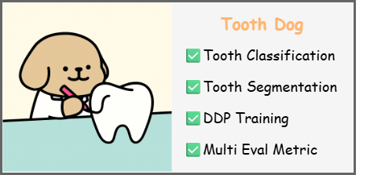
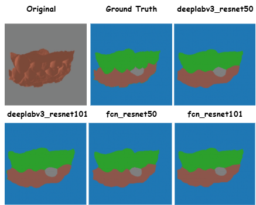

# ToothDog

A multi-task deep learning framework for dental image analysis, supporting tooth segmentation, classification, and multi-task learning with various backbone architectures.

## Introduction

This project provides a unified framework for dental image analysis tasks including tooth segmentation and classification. The model supports three training modes: segmentation-only, classification-only, and multi-task learning with proper information flow control between tasks.




## Logs and Results
Here, We only provide segmentation-only result.


View detailed training logs, metrics, and experiment tracking on [Comet ML](https://www.comet.com/ziyitsang/tooth-segmentation/view/new/panels).




## Guidelines

### Data Setup

First, create the data directory and download the dataset:

```bash
# Create data directory
mkdir -p data

# Download dataset from Google Drive
# URL: https://drive.google.com/file/d/1_KteV6HHH9oJO_NVStTw3-E0xAs8iAaN/view?usp=drive_link

# Extract to data directory to form data/ToothSegmDataset
# The final structure should be:
# data/ToothSegmDataset/
# ├── trainset_valset/
# └── testset/
```


### Environment Setup

```bash
pip install torch torchvision pytorch-lightning albumentations torchmetrics comet-ml opencv-python matplotlib
```

### Training


```bash
python multi_task_main.py --model [model_name] --mode segmentation
```
```bash
python multi_task_main.py --model [model_name] --mode classification
```
```bash
python multi_task_main.py --model [model_name] --mode multi-task
```

Replace `[model_name]` in training commands with any of the below model names.

### Multi-model Batch Training 

#### Batch Training for All Models
```bash
# Train all models in segmentation mode
./train_all_models.sh segmentation

# Train all models in classification mode  
./train_all_models.sh classification

# Train all models in multi-task mode (default)
./train_all_models.sh multi-task

# Or simply run without arguments for default multi-task mode
./train_all_models.sh
```
### Task Definitions

#### Tooth Segmentation
- **Input**: Image + Tooth ID
- **Output**: Corresponding segmentation mask
- **Description**: Segment specific tooth regions based on provided tooth ID

#### Tooth Classification  
- **Input**: Image only
- **Output**: Major tooth type (31 classes)
- **Description**: Classify the dominant tooth type in the image without tooth ID information

#### Multi-task Learning
- **Input**: Image + Tooth ID
- **Output**: Segmentation mask + Tooth classification
- **Description**: Jointly learn both tasks with proper information flow control (segmentation uses tooth ID, classification doesn't)


## Model Support

The framework supports the following segmentation models:

- **DeepLabV3**: `deeplabv3_resnet50`, `deeplabv3_resnet101`
- **FCN**: `fcn_resnet50`, `fcn_resnet101`
- **LR-ASPP**: `lraspp_mobilenet_v3_large`


